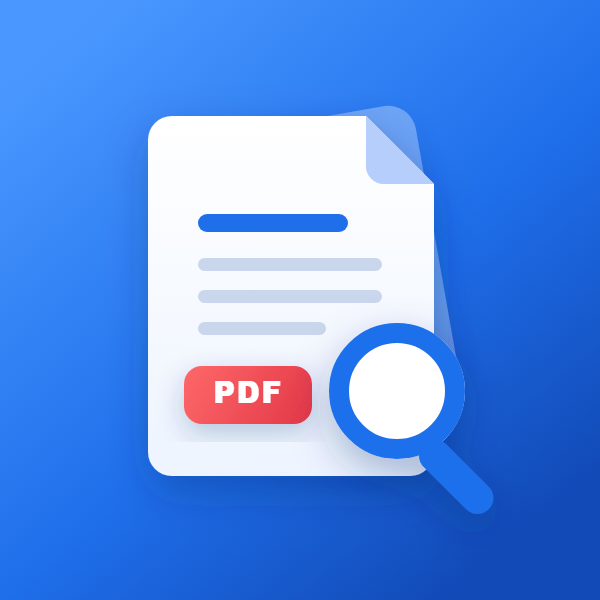
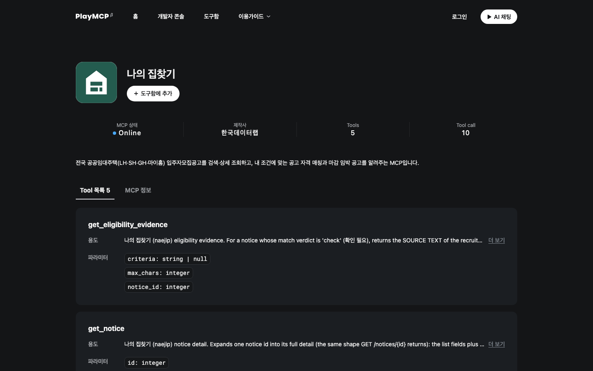
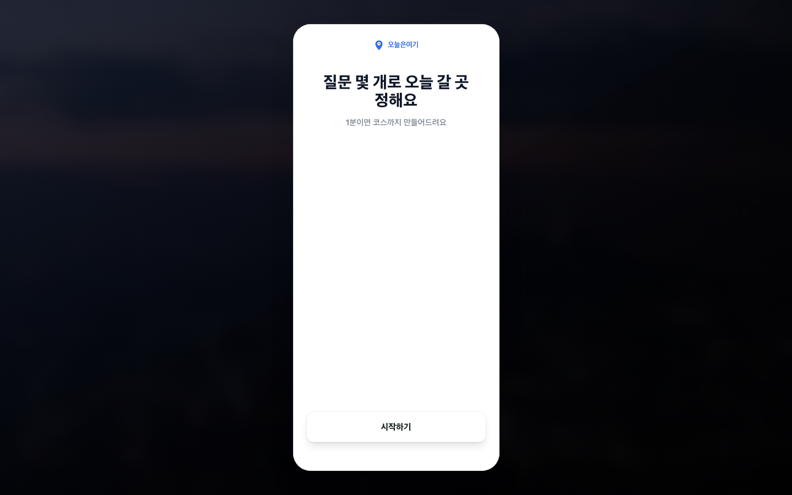
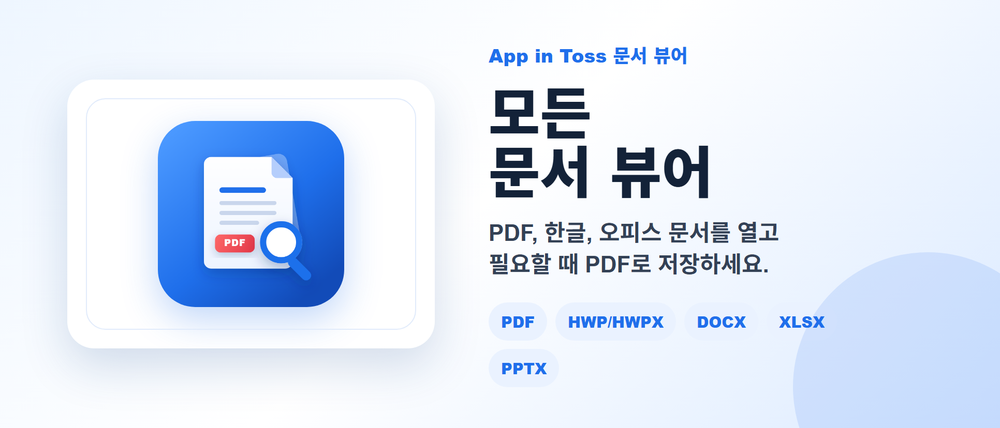
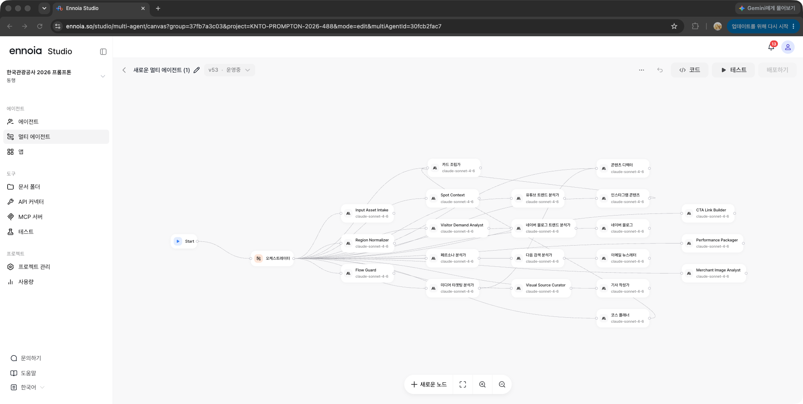

  

<h1 align="center">WeMakeAppInToss</h1>

  <strong>생활에 실제 도움이 되는 서비스를 만듭니다.</strong> 
  복잡한 주거 정보, 제각각인 문서 형식, 흩어진 지역 데이터를 
  누구나 바로 쓸 수 있는 제품으로 바꿉니다.

  공공데이터 · MCP · App-in-Toss · 문서 처리 · 지역 관광

## 만드는 것

<table>
  <tr>
    <td width="50%" align="center" valign="top">
      
        
      <strong>나의 집찾기</strong>
        
      LH·SH·GH·마이홈 공고와 첨부 문서를 구조화해 검색, 마감 확인,
      개인 조건별 자격 판단과 원문 근거 확인까지 한 대화로 연결합니다.
        
      <a href="https://playmcp.kakao.com/mcp/62130978520351333"><strong>PlayMCP에서 사용하기</strong></a>
    </td>
    <td width="50%" align="center" valign="top">
      
        
      <strong>모든 문서 뷰어</strong>
        
      PDF, 이미지, 텍스트, 마크다운, HWP/HWPX, DOCX, XLSX, PPTX와
      이미지 ZIP을 열고 PDF로 저장합니다. 문서는 서버에 올리지 않고 기기 안에서 처리합니다.
      앱을 설치하지 않아도 토스에서 바로 쓸 수 있습니다.
        
      <a href="https://minion.toss.im/zfqbqrQh"><strong>토스에서 바로 사용하기</strong></a>
    </td>
  </tr>
  <tr>
    <td width="50%" align="center" valign="top">
      
        
      <strong>오늘은여기</strong>
        
      몇 가지 질문으로 오늘 갈 시군구를 고르고, 날씨와 관광 데이터를 바탕으로
      바로 여행 코스까지 만드는 서비스입니다.
        
      <a href="https://oneulhere.com/"><strong>오늘 갈 곳 정하기</strong></a>
    </td>
    <td width="50%" align="center" valign="top">
      
        
      <strong>동행</strong>
        
      지역 관광 자산과 공공 데이터를 바탕으로 타깃 분석부터 채널별 콘텐츠,
      홍보 카드와 성과 지표까지 만드는 AI 관광 마케팅 스튜디오입니다.
        
      <a href="https://ennoia.so/apps/openLink/d5fb5f541ac84873a6e26478b19fe005"><strong>동행 살펴보기</strong></a>
    </td>
  </tr>
</table>

## 실제 화면

<table>
  <tr>
    <td width="50%" valign="top">
      
       
      <strong>나의 집찾기</strong> — 공고 검색과 자격 근거를 제공하는 공개 MCP
    </td>
    <td width="50%" valign="top">
      
       
      <strong>오늘은여기</strong> — 질문 몇 개로 시작하는 오늘의 지역 선택
    </td>
  </tr>
  <tr>
    <td width="50%" valign="top">
      
       
      <strong>모든 문서 뷰어</strong> — 설치 없이 토스에서 바로 쓰는 기기 내 문서 처리
    </td>
    <td width="50%" valign="top">
      
       
      <strong>동행</strong> — 역할별 에이전트가 협업하는 관광 마케팅 워크플로
    </td>
  </tr>
</table>

## 기록

### 한국관광공사 2026 관광데이터 AI 프롬프톤 우수상

동행은 실제 관광 데이터와 공식 사진을 바탕으로 분석, 콘텐츠 제작,
이미지 검증, 성과 지표를 하나의 멀티에이전트 흐름으로 연결해 우수상을 수상했습니다.

[동행 기획·개발 노트](https://wemakeappintoss.github.io/donghaeng-notes/) ·
[수상 기사](https://v.daum.net/v/Vz13qUJ6AE)

## 우리가 중요하게 보는 것

- **생활의 문제부터 시작합니다.** 기술 시연보다 반복되는 실제 불편을 먼저 봅니다.
- **근거를 남깁니다.** 추천과 판정은 원문, 공공데이터, 확인 가능한 출처로 되돌아갈 수 있어야 합니다.
- **사용자의 데이터를 존중합니다.** 가능한 작업은 기기 안에서 처리하고 필요한 정보만 다룹니다.
- **계속 쓸 수 있게 만듭니다.** 한 번의 데모보다 운영, 속도, 실패 복구까지 제품의 일부로 봅니다.

  <strong>주거에서 문서, 지역 경험까지. 오늘 필요한 것을 오늘 쓸 수 있게.</strong>

